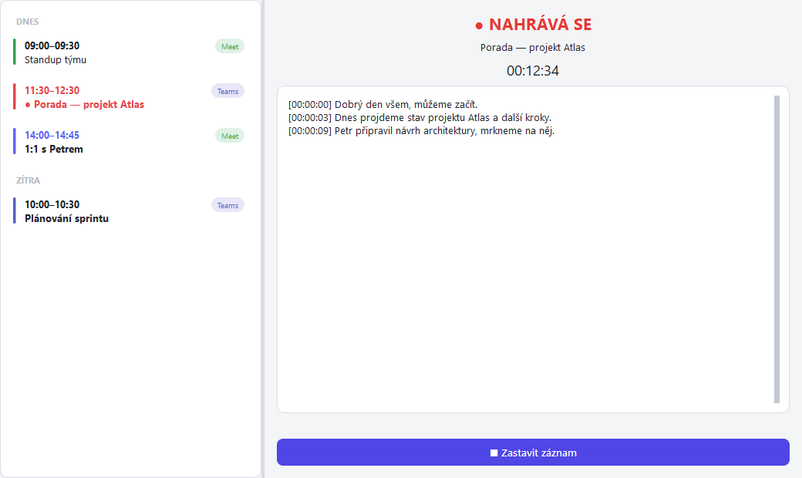
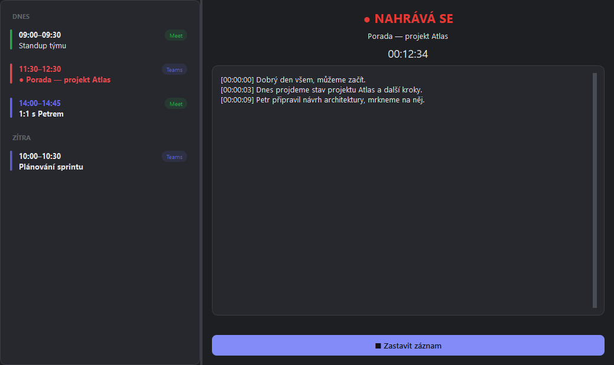

# Meeting Notetaker

A local, bot-free meeting recorder and notetaker for Windows — records your calls, transcribes them on your own machine, and saves clean Markdown notes.

## Screenshots

| Light | Dark |
| --- | --- |
|  |  |

> The in-app UI is in Czech; this documentation is in English.

## Features

- **No meeting bot.** Nothing joins your call. The app captures audio on your own machine, so there is no extra participant in the meeting.
- **Captures system audio + microphone.** Records what you hear (speaker output via WASAPI loopback) and what you say (microphone), mixed together.
- **On-device Czech transcription.** Speech is transcribed locally with [faster-whisper](https://github.com/SYSTRAN/faster-whisper). Audio never leaves your computer.
- **Two-phase transcription.** A fast `small` model produces a live transcript while you talk; after the meeting ends, the recording is re-transcribed with the higher-quality `large-v3-turbo` model and speakers are attributed (you vs. the others).
- **Calendar-driven auto-record.** Reads your Google Calendar via a secret iCal (ICS) URL and starts/stops recording automatically around your meetings.
- **Call detection.** Also detects live Google Meet / Microsoft Teams / Chrome calls (by watching which app is using the microphone) and records them even if they are not in your calendar.
- **Markdown notes.** Each meeting is saved as a single `.md` file with a header (title, time, attendees, platform) and a timestamped transcript.
- **Lives in the tray.** Closing the window hides the app to the notification area; it keeps running in the background.

## How it works

**Calendar-driven auto-record.** Every few minutes the app refreshes your calendar from its secret ICS URL (interval set by `poll_minutes`). About two minutes before a Meet or Teams meeting starts, the app "arms" itself — the meeting is highlighted in the list and a countdown appears in the right-hand panel. At the meeting's start time it begins recording automatically, and it keeps recording until shortly after the scheduled end (`stop_grace_s`).

**Call detection.** Calendar events are not the only trigger. The app watches which application currently holds the microphone (Teams, or a browser running Google Meet). When a real call starts it records it — even an ad-hoc call that is not on your calendar. To avoid empty recordings, an armed calendar meeting only starts recording once an actual call is detected, and a recording stops shortly after the call ends, even if the calendar slot is still running.

**Two-phase Czech transcription.** While the meeting is in progress, audio is transcribed live in short chunks (`chunk_seconds`) using the fast `small` model, so you can read along. After the recording stops, the saved audio is re-transcribed in the background with the higher-quality `post_model` (default `large-v3-turbo`); the live transcript in the note is then replaced with the better one, speakers are labelled (you vs. the others, by comparing microphone and loopback energy), and the temporary audio file is deleted.

**Tray and manual control.** You can start a recording at any time with the **● Nahrát teď** ("Record now") button and stop it with **■ Zastavit záznam** ("Stop recording"). Closing the window does not quit the app — it keeps running in the notification area (tray). Double-click the tray icon to bring the window back, or right-click it and choose **Ukončit** ("Quit") to exit. The tray icon colour reflects the state: grey = idle, red = recording, orange = re-transcribing in the background.

**Where notes are saved.** Notes are written to the `notes/` folder next to the app, one Markdown file per meeting (for example `notes/2026-06-12_1330_team-standup.md`). Each file has a header (title, time, attendees, platform) and a transcript with `[HH:MM:SS]` timestamps.

## Transcription accuracy

To get names and jargon right, the transcriber is given a short list of words as context. It comes from three sources:

- **Your glossary.** An editable `glossary.txt` lives next to `config.json`. It is created automatically the first time it is needed and **starts empty** (just a comment header) — add one term per line (tool, product and brand names, jargon, words that get garbled); blank lines and lines starting with `#` are ignored. Edit it at any time while the app is running via the tray item **Otevřít glosář…** ("Open glossary"); changes apply to the next transcription, with no rebuild.
- **Participant names.** The names of the people on the call are pulled automatically from the calendar invite, so the transcript spells them correctly.
- **Per-meeting topic terms.** A few likely terms (product names, acronyms, codes) are also extracted automatically from the calendar event's description for that specific meeting.

## Installation

### Windows installer (recommended)

Download the latest Windows installer from the [Releases page](https://github.com/ivantichy/meeting-notetaker/releases), run it, and launch **Meeting Notetaker** from the Start menu. On first run the app asks for your secret calendar URL (see [Configuration](#configuration)) and downloads the Whisper transcription model (this takes a little while; the model is cached in the `models/` folder and reused afterwards).

### Run from source

Requires Python and Windows.

```bat
python -m venv .venv
.venv\Scripts\pip install -r requirements.txt
python -m app.main
```

On first run the app asks for your secret calendar URL and downloads the Whisper model. (`run.bat` does the same as the last line if you prefer a double-click.)

## Configuration

The app reads your meetings from a **secret iCal (ICS) URL** for your Google Calendar. To find it:

1. Open [Google Calendar](https://calendar.google.com) in your browser.
2. Go to **Settings** (the gear icon) → **Settings for my calendars** and pick the calendar you want.
3. Open the **Integrate calendar** section.
4. Copy the **"Secret address in iCal format"**.

You can paste this URL into the dialog that appears on first run, or set it later in `config.json` under the `ics_url` key.

> Keep this URL private — anyone who has it can read your entire calendar.

Other settings live in `config.json` (see `config.example.json` for all keys and defaults), including the live and post-processing model names, polling interval, and the grace periods that control auto start/stop.

The transcription glossary is a separate `glossary.txt` next to `config.json` (auto-created, starts empty, one term per line, `#` for comments). Edit it from the tray menu (**Otevřít glosář…**) — see [Transcription accuracy](#transcription-accuracy).

## Autostart

To have notes captured without thinking about it, run Meeting Notetaker at login so it is always ready in the tray. The Windows installer can set this up for you; if you run from source, add a shortcut to `run.bat` to your Startup folder (press `Win+R`, type `shell:startup`, and drop a shortcut there).

## Privacy

Everything runs **100% locally**. Audio is captured, transcribed, and stored on your own machine — nothing is uploaded to any cloud service, and the transcription model runs entirely offline after the one-time download.

**Please tell people you are recording.** Unlike meeting bots, Meeting Notetaker does **not** announce itself or appear as a participant, so the other people on the call are **not** visibly notified that recording is happening. It is courteous — and in many places legally required — to inform participants before you record. You are responsible for complying with the recording and privacy laws that apply to you.

## Platform support

**Windows only.** System-audio capture relies on WASAPI loopback and call detection reads the Windows registry, both Windows-specific.

## Development & tests

The project ships with a unit-test suite that runs without any audio or Whisper dependencies (the `soundcard` and `faster_whisper` modules are mocked), so the tests run anywhere — including CI on Linux.

```bat
.venv\Scripts\python.exe -m pytest -q
```

There are currently **87 tests** covering calendar parsing, the scheduler, note storage, the recorder state machine, call detection, and post-processing. `ARCHITECTURE.md` describes the module layout, contracts, and threading model.

## License

Released under the MIT License. See the [LICENSE](LICENSE) file for details.
